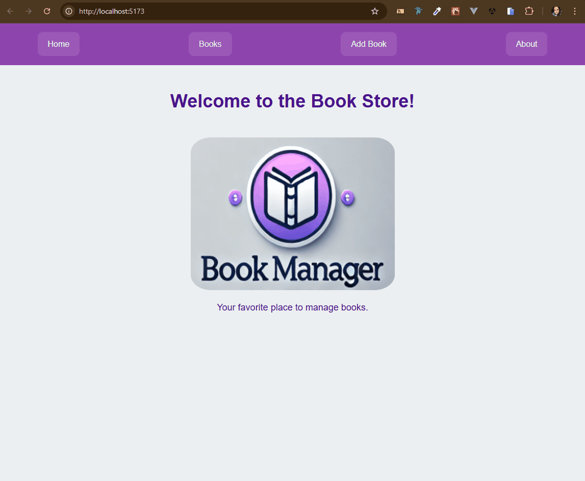

## Nome: `Daiane Deponti Bolzan`

GitHub do projeto: https://github.com/Daaaiii/reading_journal_react

Para executar este projeto:

1. Entre na pasta do projeto no terminal:
   ```
   cd reading_journal_react
   ```

2. Rode npm install para instalar as dependências do projeto:
   ```
   npm install
   ```

3. E em seguida, npm run dev, para iniciar a execução do projeto:
   ```
   npm run dev
   ```

4. O projeto estará disponível em:
   ```
   http://localhost:5173/
   ```


Após a execução do projeto, este é o resultado esperado no navegador:



## Introdução

Este projeto foi desenvolvido na disciplina de **Desenvolvimento Frontend da PUCRS** utilizando **React** e **Vite**. Ele tem como objetivo demonstrar o gerenciamento de uma coleção de livros, permitindo adicionar, editar e visualizar livros cadastrados.

A inclusão de livros é feita utilizando a tela `Add Book`. Uma vez incluído o registro, a tela é direcionada para a tela `Books` que contém a lista de livros já cadastrados. 

Para editar um livro basta clicar no botão `Edit`. O sistema abrirá novamente a tela de inclusão de livros com o formulário preenchido com os dados do livro que está sendo editado. Após clicar no botão `Edit Book`, o usuário é redirecionado a tela com a lista de livros.

A exlusão de livros é feita por meio do botão `Delete`.

## Componentes

Os componentes estão no diretório `./src/components` e possuem as seguintes características:

- **BookForm:**
  - `props`
    - addBook: função para adicionar um novo livro;
    - editBook: função para editar um livro existente;
    - books: lista de livros cadastrados.
  - Descrição: Formulário para adicionar ou editar livros, utilizando `useParams` para identificar se um livro já existe.

- **BookList:**
  - `props`
    - books: lista de livros cadastrados.
  - Descrição: Componente que exibe a lista de livros, permitindo edição e remoção.

- **Navbar:**
  - Descrição: Componente fixo exibido em todas as páginas que permite a navegação entre as seções do aplicativo.

- **About:**
  - Descrição: Página que apresenta informações sobre o projeto e seu propósito.

## Conclusão

Este projeto serve como uma aplicação prática para o aprendizado de **React Router** e **gerenciamento de estado** em React. Ele demonstra a estrutura básica de um sistema de cadastro de livros, além de reforçar conceitos fundamentais do desenvolvimento frontend com ReactJS.

